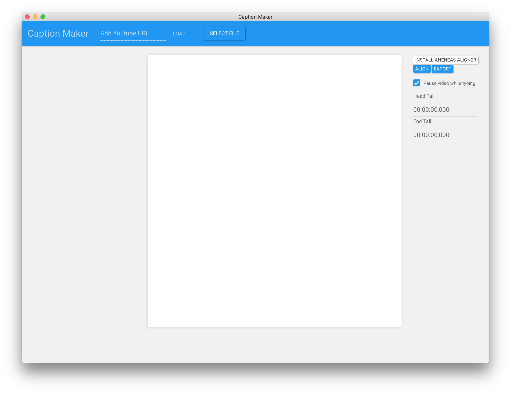
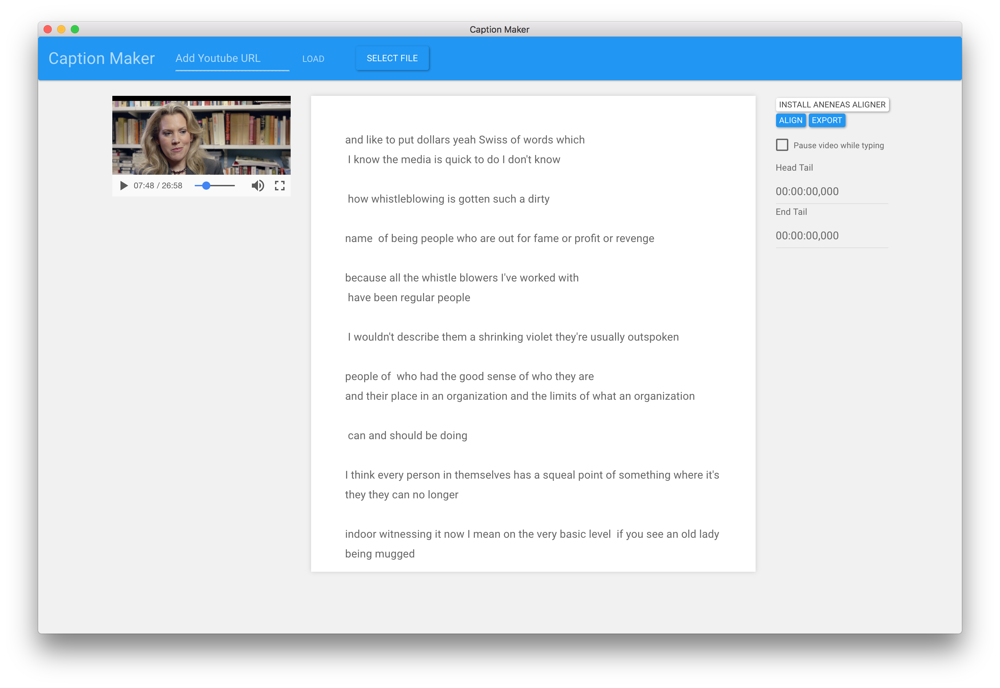
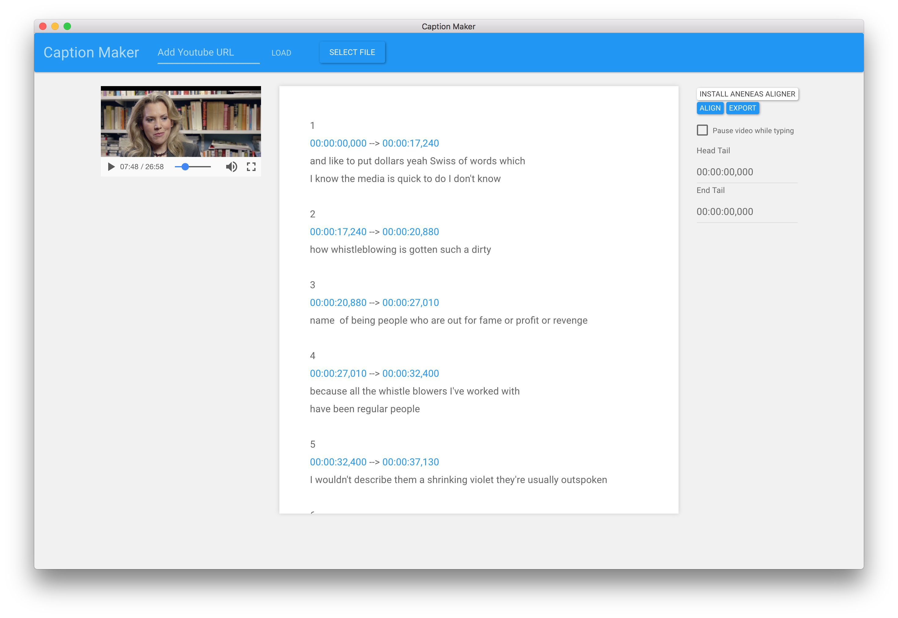

# Captioning App 

Inspired by [oTranscribe](http://otranscribe.com) and on the back of [textAV](http://textAV.tech) event unconference group.

## Dummy demo 

--->[DEMO](http://pietropassarelli.com/captioning-app/) <----

##  Screenshots and usage

Select a file, for now HTML5 media compatible, `mp4`,`wav`, `webm`, `ogg`, etc..

Type or copy and paste from automated service (eg[autoEdit.io](http://autoEdit.io))

click `align` to get a preview of an srt file, with clicable timecodes.

Review if anychanges to time and text are needed, and click `export` to save the srt file on the desktop.

Extra feature, you can also use your mac speech text from within the app, if you want to listen to the trascription. 

## Todo 

- [Using trello board for tracking development features and R&D](https://trello.com/b/Mb5GXSfN)
- Github issues for bugs. 

<!-- - Keep the spaces in navigate otpion  
srt file remove line breaks and re organise

alignement for hypertranscript keep line breaks. 
-->

###  R&D Resources

- [YouTube Player API Reference for iframe Embeds](https://developers.google.com/youtube/iframe_api_reference)
- [Wait for User to Stop Typing, Using JavaScript](https://schier.co/blog/2014/12/08/wait-for-user-to-stop-typing-using-javascript.html)
- 
- [Jquery/Javascript - Syntax highlighting as user types in contentEditable region
- [Regex and easier approach ](http://pietropassarelli.com/regex.html)

- 
-[ Aneneas installer installations instructions ](https://github.com/readbeyond/aeneas/blob/master/wiki/INSTALL.md)
-[Aneneas all in one installer release](https://github.com/sillsdev/aeneas-installer/releases)

- [other option to install aeneas (haven't tested)](https://www.npmjs.com/package/aeneas-install)

- [If you need to download youtube videos you can use this other app](https://github.com/pietrop/electron-video-downloader) (could be modified to try and scrape the automatic srt captions as well)

- [electron-quick-start](https://github.com/electron/electron-quick-start)
- [Youtube-dl increase buffer size](https://github.com/przemyslawpluta/node-youtube-dl/issues/128) `var video = youtubedl('http://www.youtube.com/watch?v=0h-qh9flX2A', ['-f=best'], {cwd: __dirname, maxBuffer: Infinity} )`

- [using spawn function with NODE_ENV=production](https://stackoverflow.com/questions/20825157/using-spawn-function-with-node-env-production)

- [coordinates](https://javascript.info/coordinates)

-[electron-run-shell-example](https://github.com/martinjackson/electron-run-shell-example)

- [Can't run command line tool using child_process after packaged](https://github.com/electron/electron/issues/7688) need to add [fix-path](https://github.com/sindresorhus/fix-path) to render process(?)

## Active Contributors 

- Pietro Passarelli

<!-- Initial requirements gathering and specification while at textAV with Joseph Polizzotto, Gideo, Marshal, and Jane -->

